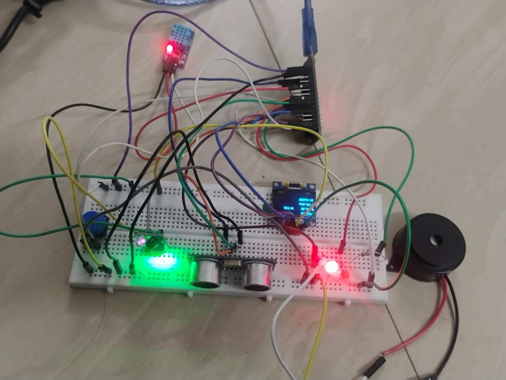

# 🚀 Project 01 - Smart Industrial Safety & Monitoring Panel

## 📖 Overview

The Smart Industrial Safety & Monitoring Panel is an ESP32-based embedded system designed to monitor industrial safety conditions in real time. It integrates multiple sensors with visual and audible alerts and provides a local web dashboard for monitoring.

---

## ✨ Features

- ✅ ESP32 Microcontroller
- ✅ OLED Display
- ✅ Temperature & Humidity Monitoring (DHT11)
- ✅ Distance Monitoring (HC-SR04)
- ✅ IR Object Detection
- ✅ Green & Red Status LEDs
- ✅ Active Buzzer Alarm
- ✅ Push Button Control
- ✅ Local Wi-Fi Web Dashboard
- ✅ Real-time Sensor Monitoring

---

## 🛠 Hardware Used

| Component | Quantity |
|-----------|----------|
| ESP32 DevKit | 1 |
| OLED Display (0.96") | 1 |
| DHT11 Sensor | 1 |
| HC-SR04 Ultrasonic Sensor | 1 |
| IR Sensor | 1 |
| Green LED | 1 |
| Red LED | 1 |
| Active Buzzer | 1 |
| Push Button | 1 |
| Breadboard | 1 |

---

## 🔌 Pin Connections

| Component | ESP32 Pin |
|-----------|-----------|
| OLED SDA | GPIO21 |
| OLED SCL | GPIO22 |
| DHT11 | GPIO4 |
| HC-SR04 TRIG | GPIO5 |
| HC-SR04 ECHO | GPIO18 |
| IR Sensor | GPIO23 |
| Green LED | GPIO25 |
| Red LED | GPIO26 |
| Buzzer | GPIO19 |
| Push Button | GPIO27 |

---

## 📂 Project Structure

```
Project-01-Smart-Industrial-Safety-Panel
│
├── README.md
└── code
    └── Smart_Industrial_Panel.ino
```

---

## 📸 Project Images

### Breadboard Setup



### Project View 1

.jpg)

### Project View 2

.jpg)

### Project View 3

.jpg)

### Project View 4

.jpg)

## 🚀 Future Improvements

- Cloud Monitoring
- Data Logging
- Mobile App
- Email Alerts
- AI-based Fault Detection

---

## 👨‍💻 Author

**Hari Kumarran**

Electronics and Communication Engineering (ECE)

Dr. Mahalingam College of Engineering and Technology (MCET)

---
